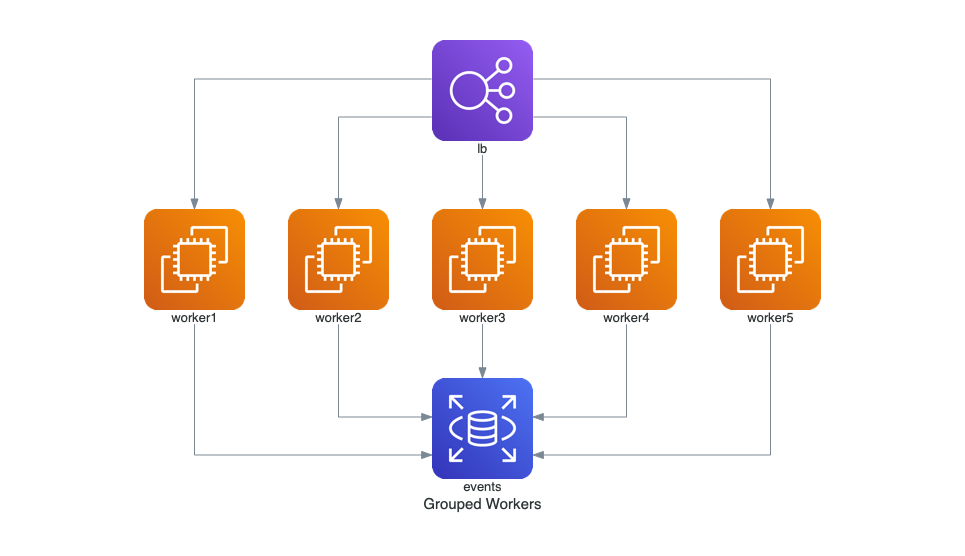

# Diagram-as-Code Client

## Description

This Node.js project provides functionalities to interact with diagram-as-code for generating and retrieving diagrams.

## Scripts

- **generate-diagram**: Generates a diagram by providing a diagram name as input and an optional path to script file, if the script path is not provided, it loads `./scripts/diag-script.py` as default. Please avoid using spaces in the name.
- **get-diagram**: Fetches the generated diagram from the server. It takes the same diagram fileId that was returned by generate-diagram and an optional path where to write the diagram. If the path is not given, it will save the image in the workspace root.
- **status**: Checks whether the diagram-as-code server is running or not. It returns "OK" if it's running.

## Configuration

- **Host**: http://localhost (Can be changed in package.json config block)
- **Port**: 8500 (Can be changed in package.json config block)
- **API Version**: v1

## Dependencies

- **axios**: ^0.24.0

## Usage

To use the scripts provided by this project, run the corresponding npm commands:

```bash
# Generate a diagram
npm run generate-diagram <diagramName> [<script_path>]

# Get a generated diagram
npm run get-diagram <fileId> [<output_path>]

# Check server status
npm run status
```

## How to create a diagram script
- here as sample diagram script:
    ```
    import sys
    diagram_name = "default-diagram-name"
    if __name__ == "__main__":
        if len(sys.argv) > 1:
            print("Name argument passed:", sys.argv[1])
            diagram_name = sys.argv[1]


    # -- diagram.py - Diagram Code starts here. --
    from diagrams import Diagram
    from diagrams.aws.compute import EC2
    from diagrams.aws.database import RDS
    from diagrams.aws.network import ELB

    with Diagram(diagram_name, show=False, direction="TB"):
        ELB("lb") >> [EC2("worker1"),
                    EC2("worker2"),
                    EC2("worker3"),
                    EC2("worker4"),
                    EC2("worker5")] >> RDS("events")
    ```
- Save it in script.py.

- Run: 
    ```
    npm run generate-diagram <diagramName> [<script_path>]
    ```
    The response will have a fileId.

- Get the generated diagram using: 
    ```
    npm run get-diagram <fileId> [<output_path>]
    ```

- Result:


More at: https://diagrams.mingrammer.com/docs/getting-started/examples

## Author

Mudassir Siddiqui